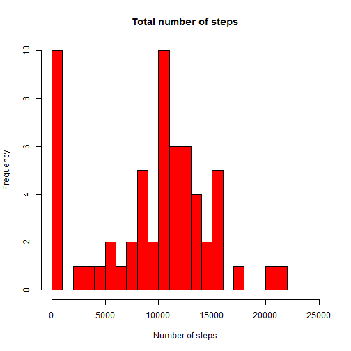

Reproducible Research Report
============================================

# Reproducible Research: Peer Assessment 1
This ist the report of my approach how I processed and analyzed the data for the first peer assignment of COursera course 'Reproducible Research'.

## Loading and processing the data 

The used is available under the following [link] (https://d396qusza40orc.cloudfront.net/repdata%2Fdata%2Factivity.zip). After the data is loaded you need to unzip the archive file and load the contained csv-file 'activity.csv'


```r
library(data.table)
act<-fread("activity.csv")
dim(act)
```

```
## [1] 17568     3
```

```r
summary(act)
```

```
##      steps           date              interval   
##  Min.   :  0.0   Length:17568       Min.   :   0  
##  1st Qu.:  0.0   Class :character   1st Qu.: 589  
##  Median :  0.0   Mode  :character   Median :1178  
##  Mean   : 37.4                      Mean   :1178  
##  3rd Qu.: 12.0                      3rd Qu.:1766  
##  Max.   :806.0                      Max.   :2355  
##  NA's   :2304
```

```r
head(act)
```

```
##    steps       date interval
## 1:    NA 2012-10-01        0
## 2:    NA 2012-10-01        5
## 3:    NA 2012-10-01       10
## 4:    NA 2012-10-01       15
## 5:    NA 2012-10-01       20
## 6:    NA 2012-10-01       25
```

## What is mean total number of steps taken per day?

1 Make a histogram of the total number of steps taken each day

```r
t_st<-tapply(act$steps,act$date,FUN=function(x) sum(x,na.rm=TRUE))
plot(t_st,col="red",type="S",xaxt="n",bg="blue",main="Total number of steps",
                xlab="Date",ylab="Totals")
axis(1, at=seq(1, 61, by=1),labels=names(t_st))
```

 

```r
day_totals<-data.frame(day=names(t_st),total_steps=t_st)
```

2 Calculate and report the mean and median total number of steps taken per day

```r
mean_steps<-mean(day_totals$total_steps,na.rm=TRUE)
median_steps<-median(day_totals$total_steps,na.rm=TRUE)
```

The mean total number of steps taken per day is 9354.2295 and the median is equal to 10395.


## What is the average daily activity pattern?

1 Make a time series plot (i.e. type = "l") of the 5-minute interval (x-axis) and the average number of steps taken, averaged across all days (y-axis)

```r
m_st_int<-act[,mean(steps,na.rm=TRUE),by=act$interval]
lines(m_st_int$act,m_st_int$V1,main="Average number of steps taken per interval",xlab="Intervals",ylab="Mean values per interval")
```

```
## Error: plot.new has not been called yet
```


2    Which 5-minute interval, on average across all the days in the dataset, contains the maximum number of steps?

```r
m_max_st<-m_st_int[max(m_st_int$V1),"act",with=FALSE]
```
Interval 1705 contains the maximum number of steps

## Imputing missing values

1 Calculate and report the total number of missing values in the dataset (i.e. the total number of rows with NAs)

```r
##get the vector for complete.cases
cc<-complete.cases(act$steps,act$date,act$interval)
##number of rows with missing values
nr_cc<-length(cc[!cc])
```

Total number of rows with missing values is 2304
